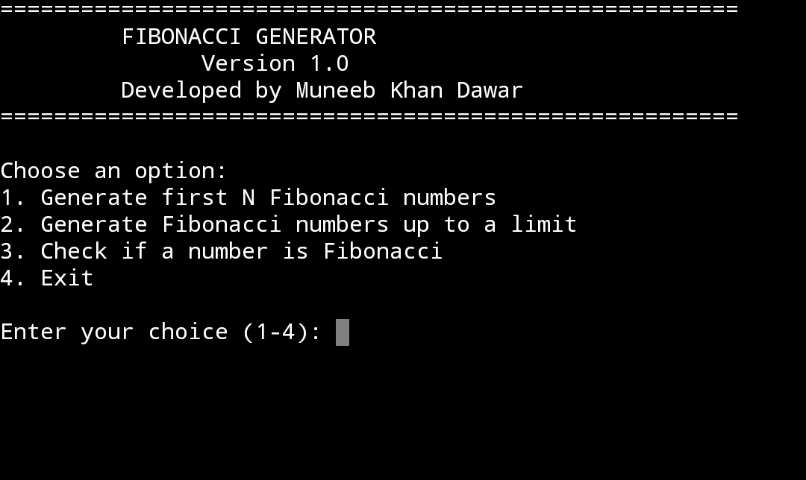
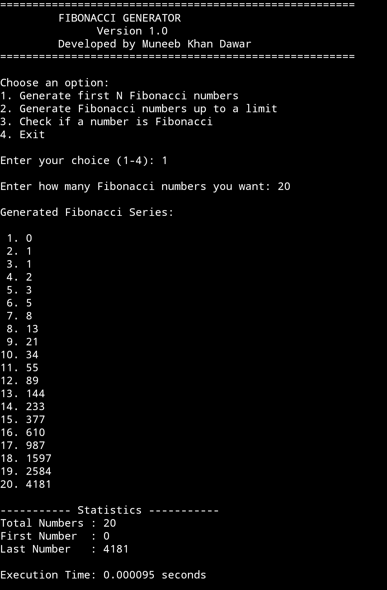
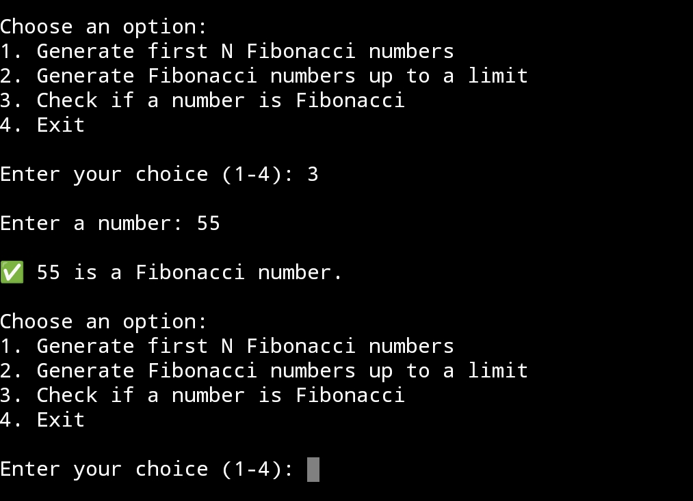

# Fibonacci Generator


A professional menu-driven Python application that generates Fibonacci sequences, checks whether a number belongs to the Fibonacci sequence, and allows users to save generated results to a text file.

---

## 📌 Features

- Generate the first **N** Fibonacci numbers.
- Generate Fibonacci numbers up to a specified limit.
- Check whether a number is a Fibonacci number.
- Display sequence statistics.
- Measure execution time.
- Save generated results to a text file.
- User-friendly menu-driven interface.
- Input validation and error handling.

---

## 🛠️ Technologies Used

- Python 3
- Math Module
- Time Module

---

## 📁 Project Structure

```
Fibonacci-Generator/
│── fibonacci.py
│── README.md
│── LICENSE
│── requirements.txt
│── .gitignore
└── screenshots/
    ├── menu.png
    ├── generate.png
    └── check.png
```

---

## ▶️ How to Run

1. Install Python 3.
2. Download or clone this repository.
3. Open a terminal in the project folder.
4. Run the following command:

```bash
python fibonacci.py
```

---

## 📋 Menu Options

```
1. Generate first N Fibonacci numbers
2. Generate Fibonacci numbers up to a limit
3. Check if a number is Fibonacci
4. Exit
```

---

## 📊 Sample Output

```
Generated Fibonacci Series:

1. 0
2. 1
3. 1
4. 2
5. 3
6. 5
7. 8
8. 13
9. 21
10. 34

Total Numbers : 10
First Number  : 0
Last Number   : 34

Execution Time: 0.000021 seconds
```

---

## 📸 Screenshots

### Home Menu


### Generate Fibonacci Numbers


### Check Fibonacci Number


---

## 🚀 Future Improvements

- Graphical User Interface (GUI)
- Export results to CSV
- Generate very large Fibonacci sequences efficiently
- Add unit tests
- Package as a desktop application

---

## 📄 License

This project is licensed under the MIT License.

---

## 👨‍💻 Author

**Muneeb Khan Dawar**

Electrical (AI & Computing)

University of Engineering and Technology (UET) Peshawar

GitHub: https://github.com/m-dawar-ai

---

## ⭐ Acknowledgements

This project was developed as part of the **Python Development Internship** to strengthen Python programming skills through practical application.
